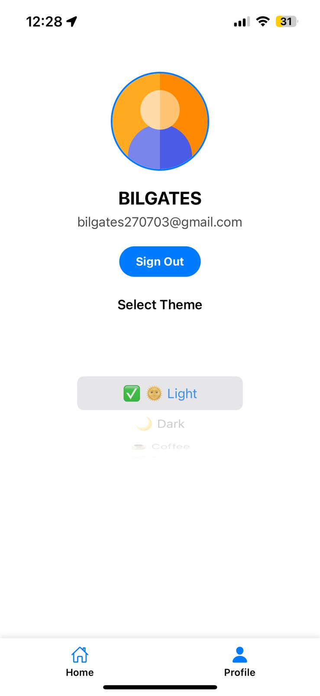
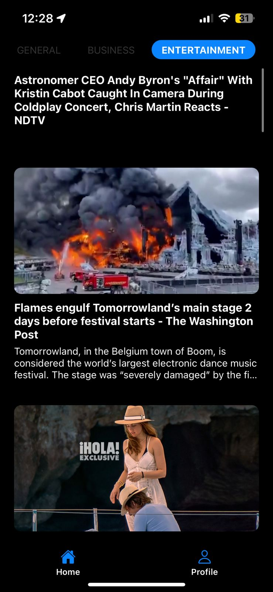
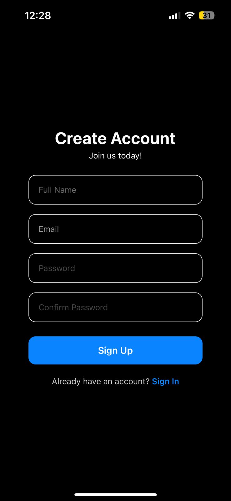
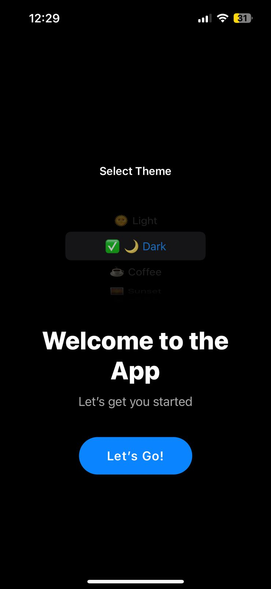
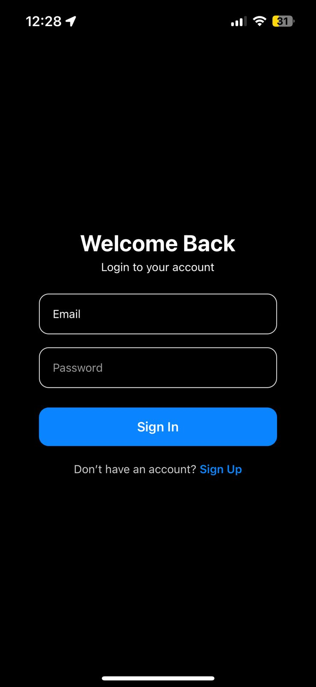
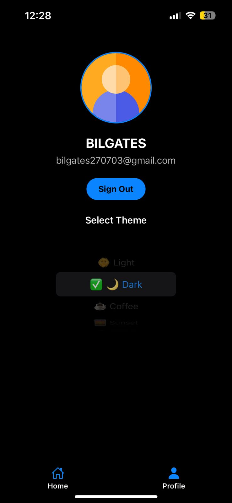
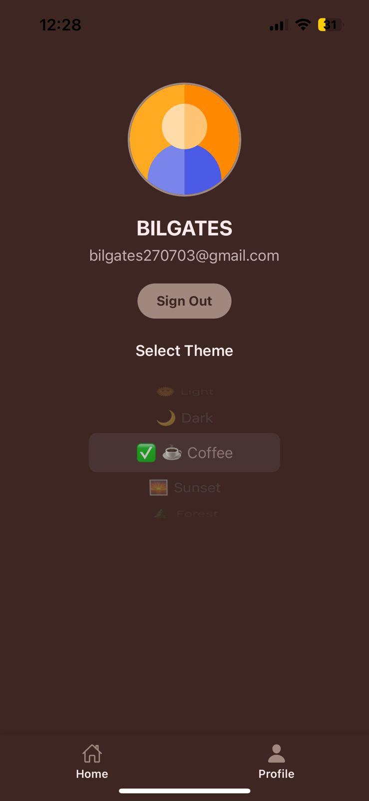

📱 LoginPage App (MERN + Expo Native)
This project is a full-stack MERN application with a React Native frontend using Expo Router, integrated with Firebase Authentication, and a Node.js/Express backend with MongoDB.

## 📸 Screenshots

  
  
  
  
  
  
  

🔧 Technologies Used
Frontend (Mobile App)
React Native (Expo 53)

Expo Router 5

React Navigation

React Native Paper

AsyncStorage

Axios

TypeScript

Backend (API Server)
Node.js

Express.js

MongoDB (with Mongoose)

bcrypt (password hashing)

CORS

dotenv